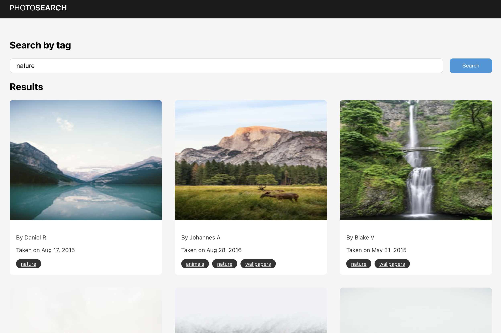

# Unsplash Search App

A simple web app that allows users to search for photos using the [Unsplash API](https://unsplash.com/developers).



## 🚀 Tech Stack

- **React** for the UI components.
- **Redux** for state management.
- **Unsplash** for retrieving photos

## 🛠️ Installation

Ensure you have [Node.js](https://nodejs.org/) installed. This project uses Node.js v22.11.0.

1. Clone the repository:

   ```bash
   git clone https://github.com/jsalvad0r/unsplash-search-app.git

   cd unsplash-search-app
   ```

2. Install dependencies:
   ```bash
   npm install
   ```

## 🔑 Environment Variables

Duplicate the .env.example file, which is located in the root of the project, and rename it to .env. Then, update the following variables:

```bash
REACT_APP_API_KEY="<YOUR_API_KEY>"
REACT_APP_BASE_API_URL="https://api.unsplash.com"
```

- REACT_APP_API_KEY: Your API key for accessing the Unsplash API.
- REACT_APP_BASE_API_URL: Base URL for the Unsplash API.

Note: The .env.example file already contains a valid API_KEY that you can use for testing purposes.

## 📦 Building and Running the App

1. Start the development server:

   ```bash
   npm start
   ```

   The app will be running at http://localhost:3000.

2. Create a production build:

   ```bash
   npm run build
   ```

   This will generate a build/ folder with optimized assets.
